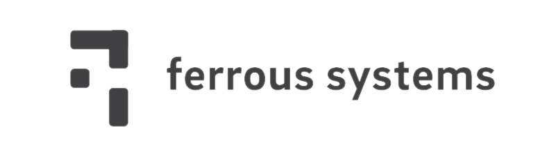

# Beginner Training

This is the Ferrous Systems beginner embedded training. It is aimed at developers who are familiar with Rust, as well as embedded systems, and are looking to learn more about embedded Rust. This training only covers a light review of the basics of the Rust Programming Language.

This training is based on the [Decawave DWM1001-DEV] development board. At least two boards will be needed to perform the entirety of this training: one for the instructor, and one for each student.

This training is intended to take one full day, and is broken into four 1.5 hour segments. These segments are a rough suggestion, some students (and groups) will make it further than the given material, and some will not. For the later segments, "reach goals" are given, to allow students to push their understanding further.

For instructions on preparing your system for the workshop, please see the [Installation Instructions].

For trainer instructions, please see the [Instructor's Guide].

[Decawave DWM1001-DEV]: https://www.decawave.com/product/dwm1001-development-board/
[Instructor's Guide]: ./docs/instructor-guide.md
[Installation Instructions]: ../INSTALL.md

## Course Overview

The following is a high level overview of the four segments of this course.

### Segment 1: Hello, Embedded Rust!

[Detailed Segment 1 Instructions](./docs/segment-1.md)

This segment aims to familiarize the students with their hardware and embedded Rust tooling. They will take an existing template project and gain familiarity with building, running, and debugging an embedded application.

High Level Goals of this section are:

1. Learn about Embedded Rust, and how it is useful for embedded developers
2. Successfully build and run a given template example, blinking an LED on the development board
3. Modify the given example to blink other LEDs

### Segment 2: Knight Rider

[Detailed Segment 2 Instructions](./docs/segment-2.md)

This segment aims to allow the students to stretch their legs, and make some larger modifications to the template given in Segment 1. Students will be asked to implement a sweeping "K.I.T.T" or "Cylon Eye" LED pattern using the four LEDs found on the board.

Students are encouraged to take advantage of features in Rust, such as iterators, to implement their LED patterns. As a stretch goal, students may implement multiple patterns, cycling through them sequentially, alternating patterns randomly, or switching based on some sort of external input, such as a button press.

High Level Goals of this section are:

1. Implement an LED Sweeping Pattern using the on-board LEDs
2. Learn more about the BSP and HAL crates included in the template
3. Stretch Goal: Implement multiple patterns
4. Stretch Goal: Randomly select patterns at runtime
5. Stretch Goal: Toggle patterns based on Button or other input

### Segment 3: Solo Draw

[Detailed Segment 3 Instructions](./docs/segment-3.md)

This segment starts the interactive portion of the class. A color grid will be displayed on the presenter's projector screen, and each student will be given a portion of the total grid that they may remotely control.

To control their grid, the students will need to send radio packets to the presenter's computer, containing X/Y coordinates and RGB values. Students are encouraged to draw patterns of their choice to the screen.

As a stretch goal, students may draw more complex patterns or pixel art images, or even draw limited animations.

High Level Goals of this section are:

1. Send radio packets using the BSP interface
2. Learn about `serde`, and automatic serialization of Rust data structures
3. Draw patterns such as gradients, shapes, or letters
4. Stretch Goal: Draw a pixel art figure on the screen
5. Stretch Goal: Draw an animation, such as a spinner or animated character

### Segment 4: Taking Turns

[Detailed Segment 4 Instructions](./docs/segment-4.md)

This segment pushes students to take turn drawing on the whole screen. The screen will rotate between participants, clearing the screen between each turn. If they wait patiently, they will be allowed to draw on the whole screen at a high rate. If they send messages when it is not their turn, they will be rate-limited in the number of messages they send.

The turns will be shown on the presenter's projector screen, and a radio message will be sent at the change of each turn.

Students can take one of three approaches to solving this, in increasing levels of difficulty:

1. Send messages at a consistent slow rate, suffering the rate limiting.
2. Wait for their turn watching the screen, and trigger their high speed drawing using a button input
3. Listen for the turn announcement by receiving radio messages, and send messages while it is their turn

High Level Goals of this section are:

1. Adapting their code to one of the three solutions above
2. Utilize a logging utility to monitor their device's behavior
3. Optional Goal: Use the on-board button as a trigger for sending messages
4. Optional Goal: Receive the "turn" broadcast messages
5. Optional Goal: Alternate between sending and receiving messages using the on-board radio
